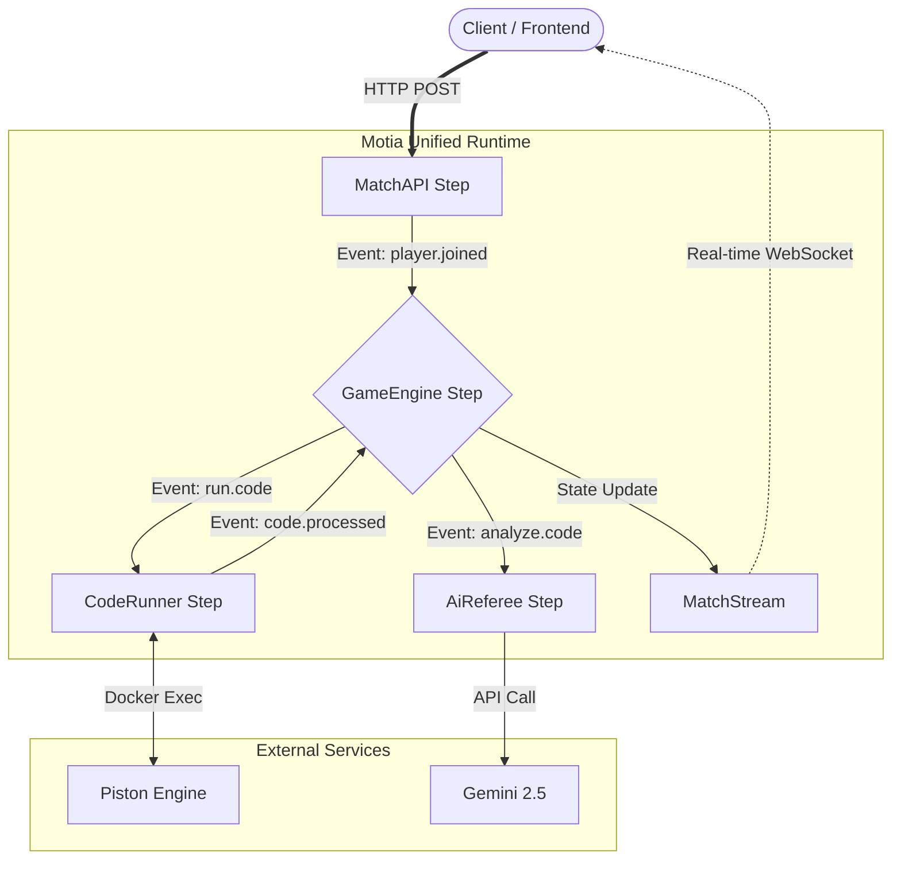

#  CodeBattle

## Real-Time 1v1 Competitive Coding Platform for Esports & Offline Events

**CodeBattle** transforms competitive programming from a solitary grind into a **live, high-stakes esports experience**. Think online chess platforms like Chess.com, but for competitive coding—designed for real-time 1v1 duels, college fests, hackathons, and coding tournaments.

Instead of asynchronous problem-solving, CodeBattle enables **synchronous competitive duels** where speed, accuracy, and strategy determine the winner in real time. Perfect for both online competitions and offline college coding events.

---

## 🎯 Why CodeBattle?

### The Gap in Competitive Programming

Most coding platforms (LeetCode, HackerRank) are built for **learning**, not **competing**:
- Static, asynchronous problem-solving
- No real-time competition pressure
- Lack of spectator engagement
- Not designed for organized events or tournaments

### The CodeBattle Difference

We're bringing the **adrenaline of esports** to competitive programming:

✅ **Live 1v1 Battles** — Real-time synchronized duels with server-authoritative timing  
✅ **Offline Event Ready** — Ideal for college fests, hackathons, and coding competitions  
✅ **Flexible Time Control** — Users select match duration (perfect for event planning)  
✅ **Multi-Language Support** — Code in Python, JavaScript, C++, Java, Go, Rust, and more  
✅ **Live Spectator Mode** — Audiences watch real-time gameplay  
✅ **AI-Powered Post-Match Analysis** — Get instant feedback on your code logic and optimizations  
✅ **Easy Room Sharing** — Create a room, share the code, challenge a friend or stranger  

---

## 🏆 Use Cases

### 💻 Online 1v1 Duels
Challenge friends or strangers to real-time coding battles. Set your own time limit and compete live.

### 🎓 College Coding Fests
Run live coding tournaments at your college events. Stream matches on a projector, engage the audience, crown a champion—all on one platform.

### 🏅 Organized Tournaments
Coming soon: **Round-robin tournament brackets** for larger competitive events. Automatically match players and track rankings.

### 🎪 Offline Events with Online Competition
Host a physical coding event while using CodeBattle's online platform to broadcast and manage competitions in real time.

---

## ✨ Core Features

### 🎮 Gameplay

| Feature | Details |
|---------|---------|
| **Room-Based Matches** | One player creates a room, shares the code, opponent joins—instant 1v1 |
| **Custom Time Control** | Set match duration to fit your event (5 min, 15 min, 30 min, custom) |
| **Multi-Language Arena** | Support for Python, JavaScript, C++, Java, Go, Rust, and more |
| **Live Code Execution** | Secure, sandboxed execution via **Piston (Docker-based)** |
| **Real-Time Verdicts** | Instant feedback on code submissions (Accepted/Rejected/TLE) |

### 👥 Spectator & Social

| Feature | Details |
|---------|---------|
| **Live Spectator Mode** | Watch 1v1 matches in real-time via WebSocket streams |
| **Synchronized Viewing** | All spectators see the exact same state—perfect for projector displays |
| **Match History** | Browse past duels and learn from top players |

### 🤖 AI Coaching

| Feature | Details |
|---------|---------|
| **Post-Match Analysis** | AI coach (Gemini 2.5) reviews your solution |
| **Logic Breakdown** | Understand *why* your solution works (or doesn't) |
| **Optimization Tips** | Time complexity analysis (`O(N)` vs `O(N²)`), edge cases, improvements |
| **Learning Mode** | Not just a verdict—a coaching experience |

---

## 🏗️ Architecture Overview

CodeBattle uses **Motia Steps** to orchestrate APIs, background jobs, AI agents, and real-time streams—all within a single unified runtime.



---

## 🔄 Match Lifecycle

1. **Create a Room**  
   Player A initiates a match, sets time limit → MatchAPI persists state → waits for opponent

2. **Share & Join**  
   Player A shares room code → Player B joins → MongoDB atomic update ensures exactly 2 players → `player.joined` event fires

3. **Match Starts**  
   GameEngine validates both players ready → synchronized timer starts → problem loaded → `match.started` event

4. **Live Coding**  
   Both players write code in their language of choice → real-time sync to spectators → verdicts returned instantly

5. **Submission & Verdict**  
   Code received → CodeRunner executes in sandbox → test cases validated → instant feedback

6. **AI Analysis**  
   Post-match, AiReferee (Gemini 2.5) analyzes code asynchronously and streams coaching feedback

---

## 🚀 Quick Start

### Prerequisites

- Node.js 18+
- MongoDB (Local or Atlas)
- Motia CLI

### 1️⃣ Clone & Install

```bash
git clone https://github.com/sambhandavale/code-battle.git

# Backend
cd battle-engine
npm install

# Frontend
cd ../battle-frontier
npm install
```

### 2️⃣ Environment Setup

Create a `.env` file in **both directories**.

#### `battle-engine/.env`

```env
MONGO_URI=mongodb://localhost:27017/codebattle
GEMINI_API_KEY=your_gemini_key_here
```

#### `battle-frontier/.env`

```env
ENV=dev
NEXT_PUBLIC_API_GATEWAY_URL=http://localhost:2000
NEXT_PUBLIC_WS_GATEWAY_URL=ws://localhost:2000
```

### 3️⃣ Run the Project

#### Terminal 1 — Backend

```bash
cd battle-engine
npm run dev
# Motia Dashboard: http://localhost:3000
```

#### Terminal 2 — Frontend

```bash
cd battle-frontier
npm run dev
# App: http://localhost:3000 (or configured port)
```

---

## 🛠️ Tech Stack

| Layer | Technology |
|-------|------------|
| **Orchestration** | Motia (unified runtime) |
| **Backend Runtime** | Node.js 18+ (TypeScript) |
| **Database** | MongoDB |
| **Code Execution** | Piston (Docker-based, sandboxed) |
| **AI Coaching** | Google Gemini 2.5 Flash |
| **Frontend** | Next.js, Tailwind CSS, Monaco Editor |
| **Real-Time** | WebSocket streams via Motia |

---

## 🗺️ Roadmap

### Current Features ✅
- Live 1v1 real-time matches
- Multi-language code execution
- Custom time control
- Live spectator mode
- AI post-match analysis

### Coming Soon 🚀
- **Tournament Mode** — Round-robin bracket system for organized events
- **Leaderboards** — Global and event-specific rankings
- **Problem Sets** — Curated difficulty tiers
- **Team Battles** — 2v2 or team-based competitions
- **Event Management Dashboard** — Tools for organizing college fests and hackathons

---

## 💡 Why Motia?

We built CodeBattle to showcase what **Motia** can do. This project demonstrates how a unified backend runtime collapses infrastructure complexity.

### Before Motia (Traditional Stack)
```
Express (API) + Redis (Pub/Sub) + Celery (Workers) + Socket.io (WebSockets)
= 4 separate systems to manage
```

### With Motia (Unified Runtime)
```
Motia Steps: API → GameEngine → CodeRunner → Stream
= 1 system, built-in event routing, automatic glue code
```

### Key Benefits We Experienced
- **Zero-config event bus** — Steps communicate via simple `emit()` calls
- **Visual debugging** — Built-in dashboard shows match flow in real-time
- **Reduced complexity** — 3× less boilerplate, 2× faster development
- **Single deployment** — All components in one runtime

Learn more: [Motia GitHub Repository](https://github.com/MotiaDev/motia)

---

## 📝 Contributing

We welcome contributions! Whether you're fixing bugs, adding languages, or improving the AI coaching, PRs are always appreciated.

### To Get Started
1. Fork the repo
2. Create a feature branch (`git checkout -b feature/your-feature`)
3. Commit your changes (`git commit -m 'Add feature'`)
4. Push and open a PR

---

## 📧 Feedback & Support

Have ideas for CodeBattle? Found a bug? Want to use it for your college event?

- Open an issue on GitHub
- Reach out with feedback—we'd love to hear how you use CodeBattle!

---

## 🙏 Acknowledgments

Massive shout-out to the **Motia team**. This project would have required **3× the code** and **2× the infrastructure complexity** without their unified runtime.

Motia made it possible to build APIs, background workers, real-time streams, and AI agents using a **single architectural primitive** — *Steps*.

---

**One runtime. One primitive. Infinite possibilities.**

*Built for competitive coding. Designed for esports. Ready for your event.* 🚀
